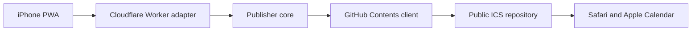

# LightCal ICS publisher threat model

## Executive summary

G5 已部署 Cloudflare Worker HTTP adapter、bearer digest authentication、exact-origin CORS、320 KiB raw body cap、兩層 rate limit、server-only GitHub client 與 redacted errors。production PAT 只可寫入 `otherwise326/lightcal-ics-public` 的 Contents；PWA 使用獨立 `lightcal-ics.pages.dev` origin。production create、replace、status exact-content 與拒絕測試已通過。最高剩餘風險是永不到期 PAT 或 device token 外洩後未及時 rotate，以及未完成的 iPhone Home Screen／Apple Calendar G6 實機驗證。

## Scope and assumptions

- In scope：`publisher/index.js` core、`publisher/worker.js` HTTP adapter、`publisher/github.js` GitHub client、PWA publisher client／device credential、`wrangler.jsonc` policy 與相關安全回歸。
- Runtime：Vue PWA 已部署至 Cloudflare Pages，Worker 已部署至 workers.dev，公開 ICS repository 由 GitHub Pages 提供。Vue build 只有 public endpoint config，沒有 GitHub credential；publisher device token 與排班 workspace 分開存在 `lightcal-ics.pages.dev` 的 local storage。
- 已確認：internet-facing 單一 LightCal instance；filename／ICS 是不可信輸入；owner／repository／branch／prefix／public base URL／allowed origin 是 server-side fixed config；公開班表內容可接受。
- 主要資產：GitHub write credential、device publisher credential、public ICS integrity、fixed repository policy 與 publisher availability。
- Out of scope：iPhone Home Screen 安裝、Mac／Codex 關閉後的實機流程、Apple Calendar production import 與長期 monitoring。

Open questions that materially change ranking：若 publisher 改為多使用者、PWA origin 改回共用 `otherwise326.github.io`，或班表內容不再允許公開，需重做 authorization、tenant isolation 與 confidentiality ranking。

## System model

### Components and trust boundaries

- iPhone PWA：本機產生 filename＋完整 ICS；raw device token 只存在獨立 versioned local record（`src/domain/publisher-client.js`）。
- Cloudflare Worker adapter：只接受 exact-origin `POST /v1/publish`，在 parse 前做 pre-auth limit／bearer digest auth／post-auth limit，body cap 後才呼叫 core（`publisher/worker.js`）。
- Publisher core：驗證 request、衍生 fixed path、執行 Contents create／replace 與一次 bounded conflict retry（`publisher/index.js`）。
- GitHub client：server-side token 只進 GitHub Authorization header；404 映射為 null，只把 status 與 SHA 回到 core，不讀 upstream error body（`publisher/github.js`）。
- Public ICS repository：fixed policy 為 `otherwise326/lightcal-ics-public`、`main`、`ics/`；與 App repo `otherwise326/lightcal-ics` 分離。PWA 使用獨立 Cloudflare Pages origin，避免和既有 GitHub Pages project sites 共用 localStorage（`wrangler.jsonc`）。

### Data flows

1. PWA 以 HTTPS JSON 傳 filename＋ICS，Authorization bearer 由 client code 明確加入，不使用 cookie。
2. Worker 要求 exact `Origin`、CORS allowlist、`application/json`、320 KiB streaming body cap；先驗證 bearer digest與 rate limit，才 parse JSON。
3. Core 只允許 filename＋ICS、180-byte filename、256 KiB ICS、strict calendar structure、fixed repository target。
4. GitHub client 以 server-side `GITHUB_TOKEN` 呼叫 Contents API；client request 無法指定 credential 或 repository policy。
5. public URL 位於另一個 origin，且不受 App service worker 控制；`/v1/status` 由 Worker server-side 讀取並比對本次完整 ICS，避開瀏覽器 CORS。班表 confidentiality 不保證，integrity 依 credential／publisher controls。

## Attacker model

### Capabilities

- 部署後可從 internet 呼叫 endpoint，送出自訂 filename、ICS、extra fields、重複／並行與 oversized requests。
- 可觀察公開 ICS URL 與檔案；班表內容本來就接受公開。
- 取得 device bearer token 後可嘗試發布合法 ICS，但仍不能直接取得 GitHub credential 或改變 fixed repository policy。
- 可誘發 GitHub 401／403／409／5xx，觀察 publisher status 與固定 error code。

### Non-capabilities

- 無法直接修改 Worker fixed config、取得 Worker secrets 或執行 process 內程式碼；若任一條件不成立需另立 threat model。
- production Worker 是 internet-facing remote entry point，但所有寫入都受 exact origin、device bearer、rate limit、strict ICS 與 fixed repository policy 限制。
- 不假設攻擊者有 GitHub owner、Cloudflare admin、App repo write 或使用者 iCloud 權限。

## Entry points

| Surface | Trust boundary | Controls | Evidence |
| --- | --- | --- | --- |
| `POST /v1/publish` | Internet → Worker | exact route/method/origin、bearer digest、rate limit、content type、body cap | `publisher/worker.js` |
| Device credential | local UI → Authorization | separate versioned record、format validation、remove action；不是 GitHub token | `src/domain/publisher-client.js` |
| ICS parser | untrusted text → core | 256 KiB、CRLF、75-byte folding、component allowlist、required fields、unique UID | `publisher/index.js` |
| Filename → path | untrusted name → fixed output | no slash、safe normalized `.ics`、fixed prefix | `publisher/index.js` |
| Runtime policy | operator config → privileged target | App／output repo separation、validated HTTPS base URL | `wrangler.jsonc`, `createRepositoryPolicy` |
| GitHub HTTPS | Worker → GitHub | server-only token、encoded path、status-only error、validated SHA | `publisher/github.js` |
| Conflict retry | GitHub 409 → write decision | refetch and retry once, then explicit 409 | `publisher/index.js` |

## Top abuse paths

1. 攻擊者取得 device bearer token → 發布或覆寫合法 ICS → public calendar integrity／quota 受損。高 entropy token、digest-only server secret、fixed repo、10/min limit 與 rotation 限縮影響。
2. 部署者把 fine-grained PAT 放進 PWA、Git、log 或錯授權 App repo → 攻擊者繞過 publisher。production PAT 已驗證只選 output repo Contents read/write，並只存在 Cloudflare Worker secret；仍須在疑似外洩時立即 revoke／rotate。
3. 攻擊者提交 `../`／額外 path／owner → 嘗試轉成任意 write proxy。HTTP adapter 原樣傳 parsed object，core exactly-two-fields 與 fixed policy fail closed。
4. 攻擊者送 oversized、invalid UTF-8 或 malformed VCALENDAR → 嘗試耗用 memory／quota。streaming 320 KiB cap 與 256 KiB strict ICS validation 在 GitHub call 前拒絕。
5. 並行 replace 同一檔名 → stale SHA 409。core refetch 後只 retry 一次，不做無界重試。
6. GitHub error body 夾帶 credential context → 嘗試透過 error response 洩漏。GitHub client不讀 error body，HTTP serializer只回固定 code。

## Threat table

| ID | Threat | Existing controls | Remaining gap／action-time mitigation | Likelihood | Impact | Priority |
| --- | --- | --- | --- | --- | --- | --- |
| TM-001 | bearer token 被竊後覆寫公開 ICS | constant-time digest auth、exact Origin、30/10 rate limit、fixed path | production 產生 32-byte token、只在核准裝置輸入、測試 revoke／rotate；CORS 不當 auth | low-medium | high | high |
| TM-002 | PAT 洩漏或可寫 App repo | PWA bundle無 PAT、Worker secret binding、repo separation、no raw error log、PAT 只選 output repo Contents read/write | PAT 為永不到期；疑似外洩須立即 revoke／rotate，定期核對權限與 bundle／log | low-medium | high | high |
| TM-003 | path traversal／arbitrary repository proxy | exactly-two-fields、filename sanitizer、fixed repo／branch／prefix、encoded path | 保留 negative production probes | low | high | low |
| TM-004 | oversized／malformed ICS 消耗資源或污染匯入 | streaming 320 KiB raw cap、256 KiB ICS cap、strict structure | production probe declared／streamed oversize、invalid UTF-8／calendar | low | medium | low |
| TM-005 | concurrent replace 造成 lost update／retry storm | one refetch＋one retry、second conflict explicit 409、10/min client limit | 若 production conflicts 頻繁才評估 per-file serialization | medium | medium | medium |
| TM-006 | upstream／runtime error 洩漏 credential | GitHub error body不讀、status-only error、allowlisted serializer、無 request logging | 檢查 Worker production logs／responses／bundle無 secret | low | high | medium |
| TM-007 | GitHub Pages propagation 尚未完成卻引導匯入舊檔 | UI 明示 Pages 可能延遲；Worker `/v1/status` 從 fixed URL server-side 比對完整 ICS，ready 後才啟用 Safari action | production probe 驗證 create／replace 與 status，不信任 browser cross-origin fetch | low-medium | medium | medium |

## Focus paths

| Path | Why it matters | Threat IDs |
| --- | --- | --- |
| `publisher/worker.js` | origin、auth、rate limit、body parsing、error serializer、secret binding | TM-001, TM-002, TM-004, TM-006 |
| `publisher/github.js` | 唯一 server credential consumer 與 GitHub boundary | TM-002, TM-005, TM-006 |
| `publisher/index.js` | input validation、fixed path、error mapping、conflict retry | TM-002, TM-003, TM-004, TM-005, TM-006 |
| `src/domain/publisher-client.js` | device credential、bearer request、public URL validation | TM-001, TM-002, TM-007 |
| `src/App.vue` | credential setup/remove、publish／Safari／copy／download／share UX | TM-001, TM-007 |
| `wrangler.jsonc` | production policy、required secret names、rate limits | TM-001, TM-002, TM-003 |
| `test/publisher-http.test.js` | HTTP auth／CORS／body cap／rate limit／redaction regression | TM-001, TM-004, TM-006 |

Quality check：已涵蓋 G5 production adapter 的 entry points 與 trust boundaries。owner／repos／branch／prefix／origin／auth／rate limit 已固定，repositories／Pages／Worker／secrets 已建立並以 production probes 驗證；iPhone Home Screen、Apple Calendar 實機匯入與長期 monitoring 保留給 G6／後續維運。
