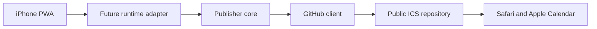

# LightCal ICS publisher threat model

## Executive summary

G4 的最高風險不在公開班表內容，而是未來 internet-facing adapter 若缺少 client authentication／rate limit，或把 GitHub write credential 帶進 PWA、log 或錯誤回應，會讓攻擊者濫用 publisher 或取得 repository 寫權。G4 core 已把 request 限縮為 `filename`＋完整 ICS、固定獨立 repository path、256 KiB、嚴格 calendar structure 與 bounded SHA retry；HTTP 暴露與 credential binding 尚未建立，必須留在 External approval Gate 明確完成。

## Scope and assumptions

- In scope：`publisher/index.js` 的 validation／GitHub port／conflict handling、`publisher/README.md` 的 adapter contract、`test/publisher.test.js` 的安全回歸。
- Runtime：G4 只有 runtime-neutral Node.js core，沒有 listener、route、deployment、secret loader 或實際 GitHub client。Vue PWA 與 ICS generator 只用來說明輸入來源；build／tests 不是 production service。
- 已確認假設：未來為 internet-facing 單一 LightCal instance；filename／ICS 是不可信輸入，repository／branch／prefix／public base URL 是 server-side 固定設定；公開班表內容可接受。
- 已確認假設：主要資產是 GitHub credential 與公開 ICS integrity；沒有多租戶、calendar DB 或機敏事件資料。
- Out of scope：client authentication、HTTP method／CORS／CSRF、rate limit、Cloudflare／其他 runtime、GitHub token／repo／Pages／DNS／secret、production logging／monitoring、PWA publisher UI。

Open questions that materially change ranking：External approval Gate 尚未決定 client authentication、runtime、公開 endpoint、rate limit 與 secret binding；若 publisher 改為多使用者或班表內容改列機敏，需重做 authorization、tenant isolation 與 confidentiality ranking。

## System model

### Primary components

- iPhone PWA：在裝置本機產生 filename 與完整 ICS；G4 尚未接上 publisher（`src/domain/schedule.js` 的 `buildScheduleExport`）。
- Future runtime adapter：未實作；未來負責 client authentication、HTTP parsing、rate limit、server-side secret 與 GitHub client 建立（`publisher/README.md`，G4 邊界）。
- Publisher core：驗證 request、衍生固定 path、執行 Contents create／replace 與一次 conflict retry（`publisher/index.js` 的 `createPublisher`）。
- GitHub client port：只接受固定 owner／repo／branch／path 與 base64 content；G4 tests 用 mock，沒有網路（`test/publisher.test.js` 的 `mockGithub`）。
- Public ICS repository：與 App code repo 分離的未來外部資源；G4 policy 會拒絕兩者相同（`publisher/index.js` 的 `createRepositoryPolicy`）。

### Data flows and trust boundaries

- PWA → future runtime adapter：filename＋ICS 經 HTTPS；G4 尚無 authentication、origin check、rate limit 或 schema parsing adapter，這是 External approval Gate 的 open boundary。
- Future runtime adapter → publisher core：已認證後的 plain object 呼叫；core 要求且只允許兩個欄位、180-byte filename、256 KiB ICS 與 strict component contract（`validatePublishRequest`／`validateIcs`）。
- Publisher core → GitHub client：server process 內的 function port；固定 repository policy 與衍生 path，content 以 base64 傳遞；credential 不在 core config 或 request（`createPublisher`、`publisher/README.md`）。
- GitHub client → GitHub Contents API：未實作的 HTTPS boundary；未來 client 必須以 server-side secret 認證、把 404 映射為 null 並保留 status 供 core 分類。
- Public ICS repository → Safari／Apple Calendar：公開 HTTPS read；URL 由固定 base URL 與 encoded path 衍生，內容 confidentiality 不保證，integrity 依 repository credential 與 publisher controls。

#### Diagram

## Assets and security objectives

| Asset | Why it matters | Security objective (C/I/A) |
| --- | --- | --- |
| GitHub write credential | 洩漏後可改寫所有被授權的公開 ICS；若權限錯配可能波及 code repo | C/I |
| Public ICS files | 使用者會匯入 Apple Calendar；惡意或錯誤內容會污染正式行事曆 | I/A |
| Fixed repository policy | 防止 client 把 publisher 轉成任意 GitHub write proxy | I |
| Publisher availability | iPhone 需要 publisher 才能取得公開匯入 URL | A |
| App code repository | 若和輸出 repo 共用寫權，publisher compromise 可竄改 PWA | I |

## Attacker model

### Capabilities

- 在 G5 後可從 internet 呼叫公開 endpoint，送出自訂 filename、ICS、extra fields、重複／並行請求與 oversized payload。
- 可觀察公開 ICS URL 與檔案；班表內容本來就接受公開。
- 可誘發 GitHub 401／403／409／5xx，並觀察 publisher 對外錯誤與重試行為。

### Non-capabilities

- 無法直接修改 server-side fixed policy、取得 runtime secret 或執行 process 內程式碼；若任一條件不成立需另立 threat model。
- G4 沒有 HTTP route，因此目前不存在 remote entry point；所有 internet risk 都是 G5 adapter 的條件式風險。
- 不假設攻擊者有 GitHub org admin、App code repo write 或使用者 iCloud 帳號權限。

## Entry points and attack surfaces

| Surface | How reached | Trust boundary | Notes | Evidence (repo path / symbol) |
| --- | --- | --- | --- | --- |
| Publish request | Future adapter function call | Untrusted client → trusted core | 僅允許 filename＋ICS | `publisher/index.js` / `validatePublishRequest` |
| ICS parser | Publish request `ics` | Untrusted text → structure validation | 256 KiB、CRLF、folding、component tree、VEVENT required fields | `publisher/index.js` / `validateIcs` |
| Filename | Publish request `filename` | Untrusted name → repository path | 不接受 slash；path 只由 fixed prefix 衍生 | `publisher/index.js` / `validateFilename` |
| Repository config | Process startup config | Operator config → privileged GitHub target | public repo 必須不同於 App code repo | `publisher/index.js` / `createRepositoryPolicy` |
| GitHub client port | Injected server dependency | Core → external API adapter | credential 不進 core；status 被正規化 | `publisher/index.js` / `callGithub` |
| Conflict retry | GitHub 409 | External concurrent state → write decision | refetch 後只 retry 一次 | `publisher/index.js` / `createPublisher` |

## Top abuse paths

1. 攻擊者找到未認證的 future endpoint → 大量發布合法 ICS → 覆寫穩定 URL／耗用 GitHub quota → 使用者取得非預期班表。
2. 部署者把 PAT 放進 PWA bundle 或 client request → 任意訪客擷取 secret → 直接呼叫 GitHub → 改寫整個授權 repository。
3. 攻擊者提交 `../`／額外 `path` → 嘗試越過 output prefix → core 拒絕 extra field 與非單一 filename，無法指定任意 path。
4. 攻擊者提交 oversized／破損 VCALENDAR → 嘗試耗用 memory 或發布 Apple 無法匯入內容 → 256 KiB 與 strict structure 在 GitHub call 前拒絕。
5. 兩個 client 同時 replace → 第二個使用 stale SHA 得到 409 → core refetch 新 SHA 並 retry 一次；再次衝突明確失敗，不進行無界重試。
6. GitHub 回傳含敏感 request context 的 401 body → 嘗試透過 client error 外洩 credential → core 只輸出固定 `publisher_upstream_unauthorized`。

## Threat model table

| Threat ID | Threat source | Prerequisites | Threat action | Impact | Impacted assets | Existing controls (evidence) | Gaps | Recommended mitigations | Detection ideas | Likelihood | Impact severity | Priority |
| --- | --- | --- | --- | --- | --- | --- | --- | --- | --- | --- | --- | --- |
| TM-001 | Remote caller | G5 endpoint internet-facing 且缺 client auth | 發布或覆寫任意合法班表檔 | ICS integrity、quota、availability 受損 | Public ICS、availability | Core 只限制 content/path，沒有假裝已有 auth（`publisher/README.md`） | Adapter/auth 尚未實作 | External approval Gate 選定強認證、fail-closed auth、per-client rate limit；未完成不得部署 | auth failure、publish rate、filename overwrite alert | high（若 endpoint 未認證） | high | high |
| TM-002 | Secret exposure／misconfiguration | PAT 被放入 client、log，或 token 可寫 App repo | 直接繞過 publisher 改寫 repository／PWA | Credential compromise、供應鏈竄改 | Credential、App code、ICS | Core request／policy 無 token；policy 拒絕 App code repo 等於 output repo（`createRepositoryPolicy`、tests） | G5 secret loader／GitHub permission 未定 | 使用 server-only fine-grained credential，只授權獨立 ICS repo Contents；禁止 secret logging；deployment artifact secret scan | GitHub audit log、unexpected repo writes、secret scanning | medium | high | high |
| TM-003 | Remote caller | 可控制 filename／request shape | Path traversal 或指定 owner/repo/path，轉為任意 write proxy | 改寫非預期檔案 | Repository policy、App code | Exactly-two-fields、slash rejection、fixed prefix/repo、repo separation（`validatePublishRequest`、`test/publisher.test.js`） | Future adapter 需避免預先 decode 後再組 path | Adapter 傳原始 parsed string給 core；GitHub path segments 正確 encode；保留 tests | rejected request counts by code | low | high | low |
| TM-004 | Remote caller | 可提交任意 ICS | 發布 malformed、duplicate UID 或 oversized calendar | Apple import 錯誤、memory／API quota 消耗 | ICS integrity、availability | 256 KiB、CRLF/75-byte line、allowlisted components、required fields、unique UID（`validateIcs`） | HTTP body limit 尚未在 parser 前設定 | Adapter 在讀 body 時同樣設 256 KiB hard limit；content type 檢查；timeout | payload size histogram、validation failures | medium | medium | medium |
| TM-005 | Concurrent legitimate／malicious callers | 同 filename 同時 replace | 利用 stale SHA 造成 lost update 或重試風暴 | 最後一次內容不確定、availability 降低 | ICS integrity、availability | 409 refetch＋一次 retry，再衝突明確 409（`createPublisher`、conflict tests） | 無 idempotency key、per-file serialization | G5 先保持 bounded retry；若實測頻繁，再加 per-file queue／idempotency，而非無界 retry | conflict and retry counters | medium | medium | medium |
| TM-006 | Upstream／error handling bug | GitHub client error 夾帶 headers/body | 對外回傳 upstream detail，洩漏 secret | Credential confidentiality | GitHub credential | 固定 error code，401 mock secret 不出現在 error（`callGithub`、credential test） | Future HTTP error serializer／logger 未實作 | Error response allowlist；redact authorization/header/body；structured logs 不含 injected error object | secret patterns in logs、upstream error count | low | high | medium |

## Criticality calibration

- critical：可在無前置權限下取得 GitHub credential 且 token 能寫 App code；或可遠端執行 publisher process。此 repo 目前沒有這類入口。
- high：未認證 internet endpoint 可穩定覆寫公開 ICS；server token 被前端公開；output token 可修改 App code repo。
- medium：可重複造成 publisher quota／可用性下降；malformed ICS 通過造成多次匯入失敗；錯誤處理在特定 upstream failure 洩漏 credential context。
- low：需要 operator 先改壞固定 policy 才能越界；只影響已接受公開的班表 confidentiality；單次明確 409 且可重試。

## Focus paths for security review

| Path | Why it matters | Related Threat IDs |
| --- | --- | --- |
| `publisher/index.js` | 唯一 privileged core：input validation、fixed path、error mapping、conflict retry | TM-002, TM-003, TM-004, TM-005, TM-006 |
| `publisher/README.md` | G5 adapter 的 credential/auth/body-limit security contract | TM-001, TM-002, TM-004, TM-006 |
| `test/publisher.test.js` | 固化 create/replace、path、size、credential 與 conflict negative cases | TM-002, TM-003, TM-004, TM-005, TM-006 |
| `src/domain/ics.js` | 產生 publisher 應接受的完整 VCALENDAR；contract drift 會造成 false reject／accept | TM-004 |
| `src/domain/schedule.js` | 產生 filename 與公開班表內容，是 untrusted request 的 client-side來源 | TM-003, TM-004 |

Quality check：已涵蓋 G4 發現的所有 entry point 與 trust boundary；已分開 future runtime、current core、build/test；assumptions 已由專案 owner 確認；External approval Gate 的 auth/runtime/secret/monitoring 仍明確列為 open questions。
